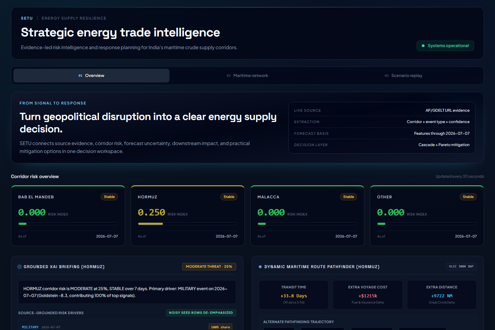
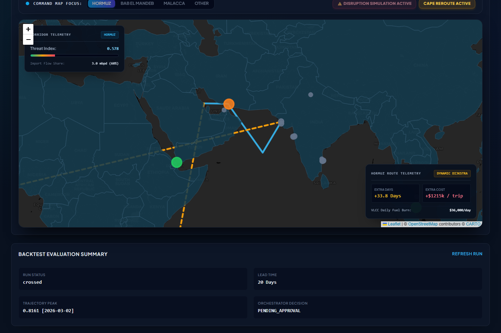
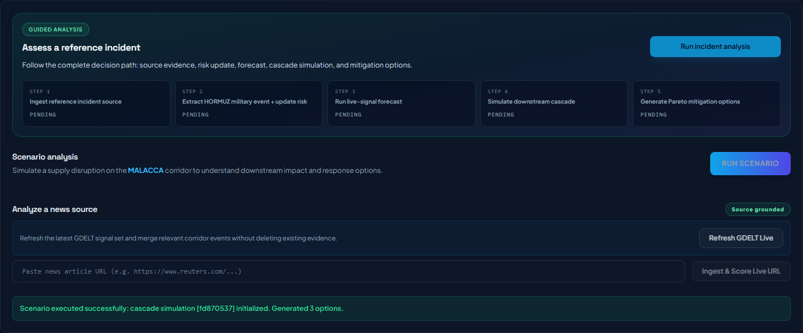

# SETU — Strategic Energy Trade Intelligence

> **AI-powered energy supply-chain resilience for import-dependent economies.**

SETU turns a credible geopolitical news signal into an operational decision trail: it extracts the event, identifies the affected Indian crude-oil corridor, forecasts risk, simulates downstream disruption, and presents explainable mitigation options for human approval.

Built for **ET AI Hackathon 2.0 — PS 2: AI-Driven Energy Supply Chain Resilience for Import-Dependent Economies**.

## Evidence-backed early warning

> **SETU flagged elevated Hormuz risk on 10 February 2026 — 20 days before the 2 March Hormuz closure reference date documented in [EIA's March 26 analysis](https://www.eia.gov/todayinenergy/detail.php?id=67386).**

The replay crossed a pre-locked `0.437501` threshold at `0.578125`. The threshold was derived from a separate 17-day January baseline; this is a reproducible **N=1** historical result with a short-baseline caveat, not a broad accuracy claim. See the [full result](docs/backtest_results.md) and [calibration record](docs/threshold_calibration.md).





## The problem

India's crude-oil supply depends on vulnerable maritime corridors. During a geopolitical disruption, teams need more than headlines: they need to know which corridor is affected, what could fail next, how risk may evolve, and which mitigation has the best trade-off between risk reduction, time penalty, and cost.

## What SETU does

| From signal to decision | SETU capability |
|---|---|
| **1. Evidence** | Ingests a source URL and retains the title, publisher, timestamps, confidence, evidence terms, and source link. |
| **2. Corridor risk** | Extracts the disruption and updates the relevant corridor risk score (for example, HORMUZ). |
| **3. Forecast** | Produces short-horizon risk telemetry from the current signal state. |
| **4. Cascade** | Runs a Monte Carlo supply-chain cascade to estimate downstream operational impact. |
| **5. Mitigation** | Generates Pareto-oriented options with an explicit “Why this recommendation?” explanation and human approve/reject control. |

The dashboard deliberately distinguishes source-grounded evidence from lower-confidence seeded rows. SETU is decision support, not an autonomous trading or procurement system.

## Operational incident analysis

1. Start the stack and open [http://127.0.0.1:5173](http://127.0.0.1:5173).
2. Click **Run incident analysis**.
3. Watch the five completed stages: source evidence → HORMUZ risk update → forecast → cascade simulation → mitigation options.
4. Inspect the evidence card and recommendation explanations. Each recommendation exposes its risk, time, and cost trade-offs before approval.

The reference workflow uses a credible AP incident source so that the full response chain can be repeated consistently. SETU also supports manual source-URL ingestion and a live GDELT pipeline trigger; external-source availability can naturally vary.

## Quick start (Docker)

### Windows (Docker Desktop)

```powershell
git clone https://github.com/Yumekaz/SETU.git
cd SETU
docker compose up --build
```

Then open:

- Dashboard: [http://127.0.0.1:5173](http://127.0.0.1:5173)
- API health: [http://127.0.0.1:8000/health](http://127.0.0.1:8000/health)
- API contracts: [http://127.0.0.1:8000/api/contracts](http://127.0.0.1:8000/api/contracts)

No API key is required for the reproducible local path. Stop the stack with `docker compose down`.

### Linux/macOS

```bash
git clone <https://github.com/Yumekaz/SETU>
cd SETU
docker compose up --build
```

On Ubuntu using Snap Docker, run `sudo bash scripts/fix-docker-permissions.sh` once, log out and back in, then retry the command. Alternatively use `sudo docker compose up --build`.

## Verification

The project includes automated tests, a Docker health check, and a browser-verified end-to-end incident workflow.

```powershell
# Frontend
cd frontend
npm test -- --run
npm run build

# From repository root: Docker stack
cd ..
docker compose up -d --build
```

For the original reproducibility scripts on a Unix-like shell:

```bash
bash scripts/demo_preflight.sh
python3 scripts/run_phase8_verification.py
```

## Architecture

```text
News URL / GDELT signal
          ↓
Evidence extraction + confidence scoring
          ↓
Corridor risk scoring and short-horizon forecast
          ↓
Monte Carlo cascade simulation
          ↓
Pareto mitigation options + human approval
```

The frontend is React/Vite; the API is FastAPI; state is persisted in SQLite; the simulation layer models corridor disruption cascades. JSON schemas in `schemas/` define the contracts shared across the application.

## Repository layout

```text
backend/       FastAPI API, extraction, risk, forecast, simulation, and orchestrator
frontend/      React dashboard and guided incident-response workflow
schemas/       Frozen JSON contracts and generated model inputs
data/          SQLite data, source samples, fixtures, and timeline data
docs/          Architecture, methods, limitations, verification, and submission material
scripts/       Reproducibility, data, and validation utilities
tests/         Backend and contract tests
```

## Data integrity and limitations

- The UI shows source URL, publisher, timestamps, evidence terms, and extraction confidence whenever URL ingestion succeeds.
- The reference workflow is reproducible and does not claim that every displayed value is live market data.
- External news and GDELT availability may change; real-world operational deployment requires expanded source coverage, validation, security, and domain review.
- Forecasts are decision-support signals, not price predictions or procurement instructions.
- The calibrated Hormuz replay crosses on **2026-02-10**, **20 days** before the [2 March closure reference date documented in EIA's March 26 analysis](https://www.eia.gov/todayinenergy/detail.php?id=67386), at score `0.578125` against the pre-locked `0.437501` threshold. The threshold is one six-decimal increment above the maximum score in a separate 17-day Jan baseline, producing 0 observed baseline alerts; this is N=1 evidence with a short-baseline caveat, not broad accuracy proof. See [the reproducible result](docs/backtest_results.md) and [calibration protocol](docs/threshold_calibration.md).

Full limitations: [docs/known_limitations.md](docs/known_limitations.md). Data-source notes: [docs/data_sources.md](docs/data_sources.md). Architecture: [docs/phase8_architecture.md](docs/phase8_architecture.md).



## Submission assets

- [Detailed architecture](docs/phase8_architecture.md)
- [3-4 minute recording script](docs/submission/demo_video_script.md)
- [Video outline](docs/submission/video_outline.md)
- [Detailed submission PDF](output/pdf/SETU_ET_AI_Hackathon_Detailed_Submission.pdf)

## License

Hackathon submission project. All third-party sources remain subject to their respective terms.
