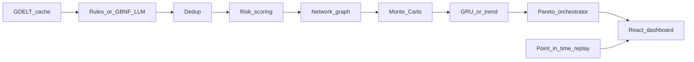

# SETU Architecture (Submission Summary)

Trimmed from SRS for judges and video narration. Full spec: `docs/SETU_SRS_Phased_Build_Plan.md`.

## Problem

India imports ~88% of crude through a few maritime corridors. Disruptions require fast, auditable decisions — not another monitoring feed.

## Positioning

| Monitoring (Kpler, etc.) | SETU |
|--------------------------|------|
| Vessel/cargo signals | Geopolitical + ops signals |
| Alerts | Cascade simulation + forecasts |
| Dashboard | Prescriptive procurement options |

## Pipeline

## Data contracts

Frozen JSON schemas in `/schemas/` — single source of truth. Generated types:
- Backend: `backend/app/models/generated.py`
- Frontend: `frontend/src/types/generated.ts`

## Key design choices

1. **Neuro-symbolic** — LLM extracts; deterministic code scores and recommends
2. **Offline-first** — cached samples; no live keys required for demo
3. **Honest uncertainty** — p10/p50/p90 bands everywhere
4. **N=1 backtest honesty** — Hormuz 2026 window; limitations documented

## Limitations

See [known_limitations.md](known_limitations.md) — mobile layout, AIS, second crisis, long-horizon forecast deferred by design.

## Demo entry points

| Surface | URL / script |
|---------|----------------|
| Full stack | `bash scripts/demo-up.sh` |
| Preflight | `bash scripts/demo_preflight.sh` |
| API health | `GET /health` → phase 8, v1.0.0 |